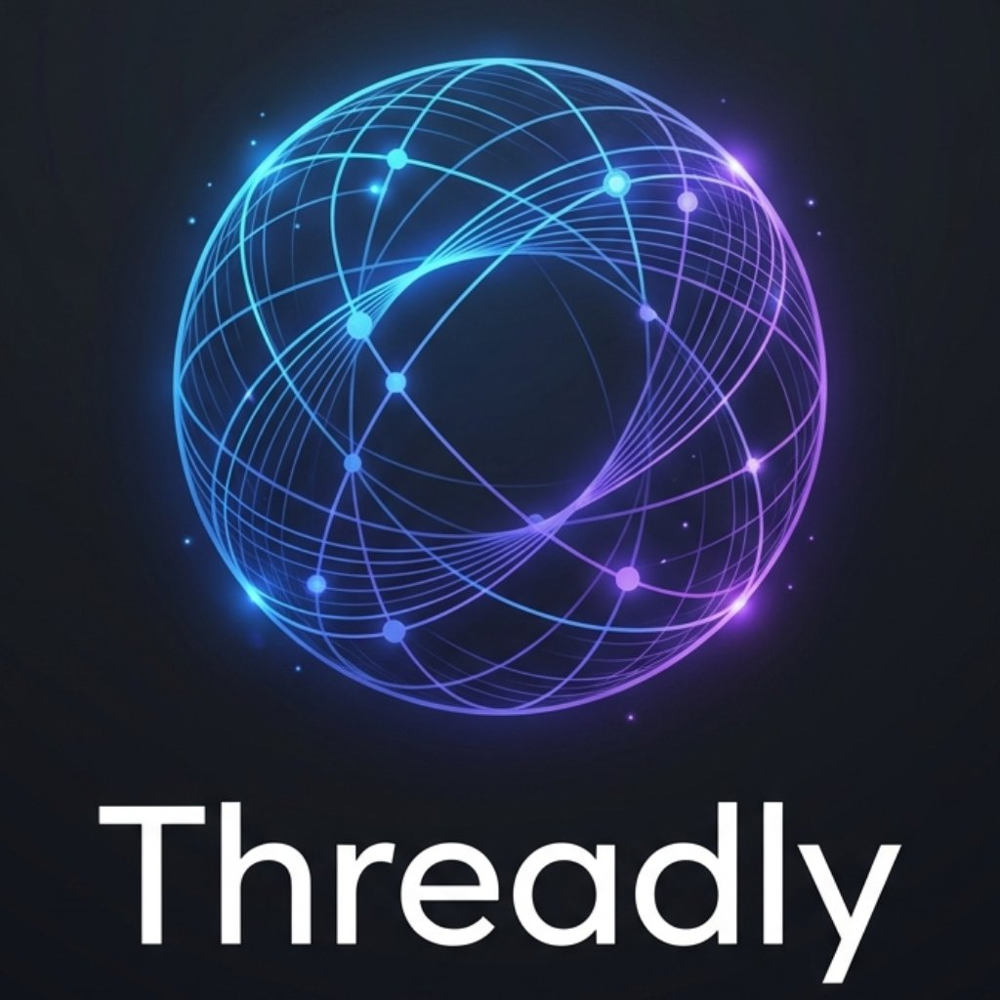

<div align="center">



# Threadly AI

### The AI Workspace for Deep, Long Conversations

**Stop losing context. Stop scrolling endlessly. Start thinking clearly.**

[](https://threadly-ai-zeta.vercel.app)
[](https://opensource.org/licenses/MIT)
[](https://github.com/rohanvibe/threadly-AI/stargazers)
[](https://github.com/rohanvibe/threadly-AI)
[](https://github.com/rohanvibe/threadly-AI/commits)

<br />

> **Stop losing context in AI chats.** Threadly is a high-performance workspace designed for complex flows and long-term memory.

</div>

---

## 🚀 Why Threadly? (The Pain Point)

Every traditional AI chat app has the same flaw: **long conversations become unusable.**

- **The Memory Leak:** You lose track of what was said 40 messages ago.
- **The Scroll Fatigue:** You can't jump back to a key decision point without scrolling for minutes.
- **The Context Reset:** Your "memory" disappears when you close the tab.
- **The Black Box:** You have no control over your API keys or data persistence.

**Threadly is built specifically to bridge this trust and context gap.**

---

## ⚡ Why not ChatGPT?

| Feature | ChatGPT / Generic Wrappers | Threadly AI |
|---|---|---|
| **Deep Navigation** | Endless scrolling only | **Instant Thread Sidebar Anchors** |
| **Persistent Memory** | "Custom Instructions" (Limited) | **Semantic, Tag-Based Fact Store** |
| **Data Control** | Their server, their rules | **Your Keys (BYOK), Your Database** |
| **Interface** | One-size-fits-all | **Pro-Grade Workspace (Shortcuts, Maps)** |
| **Latency** | Perceptible cloud delay | **Zero-Delay Streaming (groq AI)** |

---

## 📽️ Proof in Motion

> [!TIP]
> **See it in action.** Threadly isn't just a shell; it's a high-performance inference engine.


*Real-time streaming powered by Llama 3.3 70B via groq AI.*

---

## 🧠 Core Pillars

### 🧵 Deep Navigation Sidebar
Every user message becomes a clickable anchor. Instantly jump to any point in a 200-message conversation. It’s a "Table of Contents" for your thoughts.

### 🧠 Persistent Brain (AI Memory)
Threadly intelligently remembers facts across sessions. Using a tag-based system, it only injects facts when contextually relevant — keeping your context window clean and your AI focused.

### 🔑 Bring Your Own Key (BYOK)
Total sovereignty. Use your own OpenAI or groq AI keys. Keys are stored in your browser's local storage — they never touch our servers.

### 📱 PWA & Offline Shell
Install Threadly on your desktop or mobile. The UI shell is fully offline-capable, ensuring your workspace is always ready when the spark hits.

---

## 🛠️ Tech Stack

- **Framework:** Next.js 16 (App Router, Turbopack)
- **Database/Auth:** Supabase (PostgreSQL + RLS)
- **AI Engine:** groq AI (LLaMA 3.3 70B)
- **Styling:** Tailwind CSS v4 + Apple Design Language
- **Animations:** Framer Motion

---

## 📦 Quick Start

Get your private workspace running in under 3 minutes.

### 1. Clone & Install
```bash
git clone https://github.com/rohanvibe/threadly-AI.git
cd threadly-AI
npm install
```

### 2. Configure Environment
Create a `.env.local` file:
```env
NEXT_PUBLIC_SUPABASE_URL=your_project_url
NEXT_PUBLIC_SUPABASE_ANON_KEY=your_anon_key
groq_API_KEY=your_api_key
```

### 3. Run
```bash
npm run dev
```

---

## 🛣️ Roadmap

- [x] High-speed Llama 3.3 Integration
- [x] Semantic Memory Sync
- [ ] Multi-model Support (Claude 3.5, Gemini 1.5)
- [ ] Voice-to-Thought (Whisper Sync)
- [ ] Collaborative Workspaces

---

## 📄 License

Threadly is now licensed under the **MIT License**. We believe in open-source growth and invite the community to build, fork, and star.

---

<div align="center">

Built with care. Designed for focused work.

**[⭐ Star this repo](https://github.com/rohanvibe/threadly-AI) · [Report a Bug](https://github.com/rohanvibe/threadly-AI/issues/new) · [Request a Feature](https://github.com/rohanvibe/threadly-AI/issues/new)**

</div>